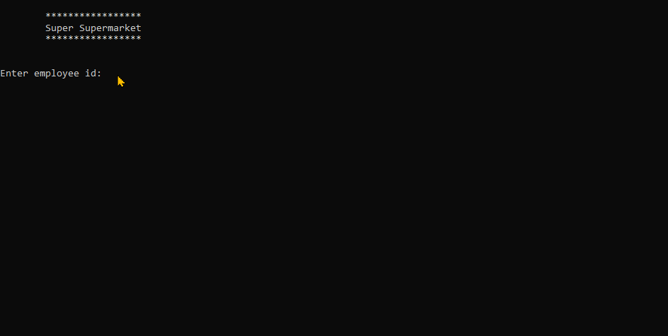

# Spring 2024 Assignment 01 - Arithmetic Expressions
__Weight:__ 5% of final mark

([Return to Assignments](../README.md))

__Submission requirements:__ On or before the deadline, commit a .Net Core 8 Visual Studio 2022 project to the GitHub repository. __You must commit and push to the classroom repository supplied for the assignment__; do not create your own repository. It is your responsibility to ensure that your work is in the correct repository. ___Work not in the repository will not be graded___.

## Monthly Pay
The owners of the Super Supermarket would like to have a program that computes the monthly gross, taxes and net pay of their employees. The input for this program is an employee ID number, the hourly rate of pay, deductions and the number of regular and overtime hours worked. Note: gross pay is the sum of the wages earned from regular hours and overtime hours; overtime is paid at 1.5 times the regular rate. Net pay is the amount of money given to the employee (gross pay less taxes and deduction). The tax rate is 30% of gross pay. Display the monthly gross pay, tax withholding and net pay as monetary amounts.

### Requirements

Within your opening documentation of your program, you will create a detail step plan of your solution (as demonstrated by your instructor).
You will code a program to solve the stated problem. Your program ***must*** following the class standards and any instructor requirements.

Your program will need to prompt the user for several inputs, namely:

- employee id: the employee number
- hourly rate of pay: hourly wage of the employee
- deductions: total monetary amount for benefits such as but not limited to parking, meals, etc.
- number of regular hours worked: example 15.5 hours.
- number of overtime hours worked: example 5.5 hours.

The program will produce and display the monthly gross pay, tax withholding, deductions and net pay as monetary amounts. Use constants within your code where appropriate.

### Note: For this assignment, assume input data will be valid values. 

### Sample Run

### Note: It is suggested that you run your program with different values to ensure your calculations are correct.

## Submission
Commit and push your solution to your GitHub classroom assignment repository before the deadline. Ensure that your solution follows the best coding and style practices, **as your instructor has shown you in class**. Failed adherence to the prescribed style guidelines may result in lost marks. __Your program must compile; a program that fails to compile will not be graded.__

## Code Requirements
- A C# comment block at the beginning of the source file describing the purpose, author, and last modified date of the program
- Write only one statement per line
- Use TitleCase for local variable names
- Use CAPITAL_CASE for any constant variable names

## Rubric
| Mark | Description |
|---|---|
| 5  | Excellent – all requirements meet; program passes all test cases; coding follows best practices and class standards |
| 4  | Very Good – all requirements meet, program passes all test cases; coding does not follow best practices and class standards |
| 3  | Acceptable – coded most the requirements; program produces the expected results for some of the test cases; coding does not follow best practices and class standards |
| 2  | Needs Work – coded some the requirements; program fails to produce expected results; coding does not follow best practices and class standards |
| 1  | Unsatisfactory – code does not meet any of the requirements; coding does not follow best practices and class standards |
| 0  | Not done |

