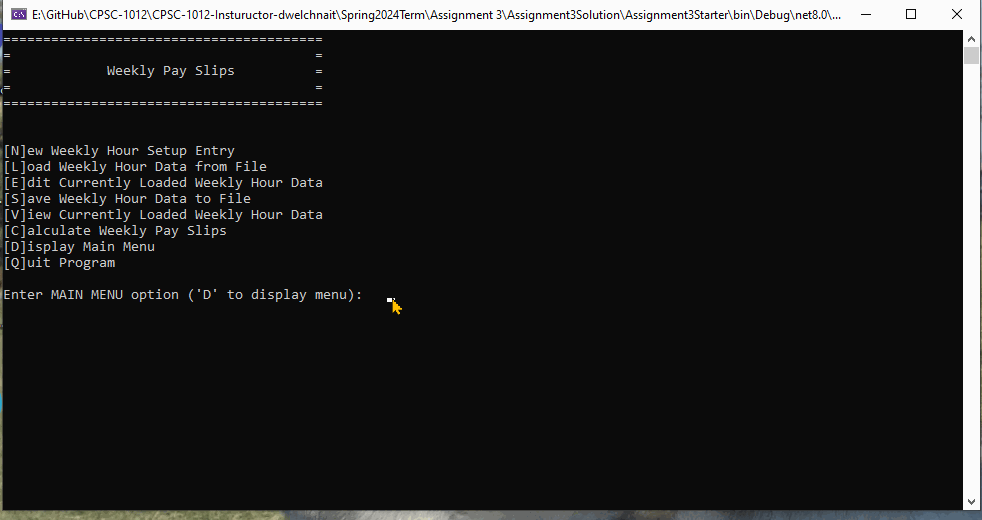
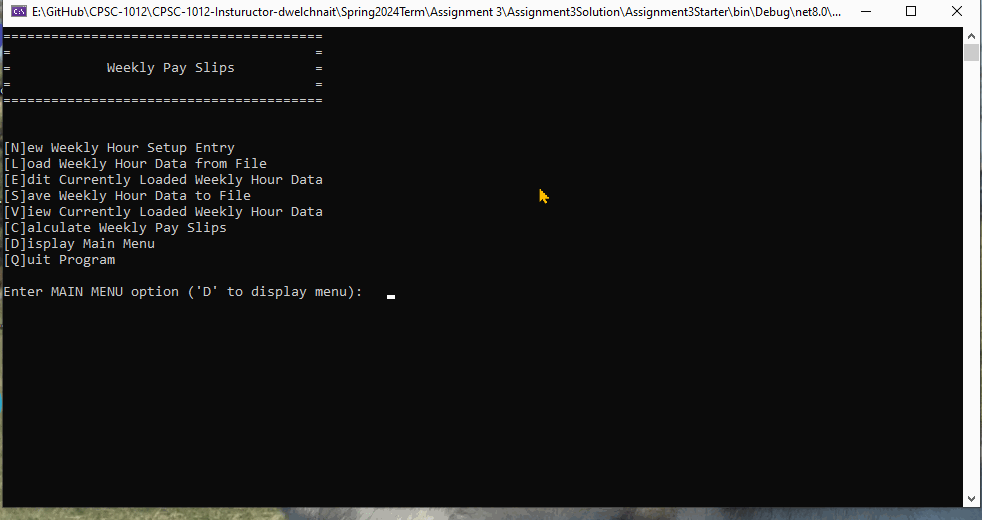

# Spring 2024 Assignment 03 - Methods, Arrays, and File I/O
__Weight:__ 15% of final mark

__Submission requirements:__ On or before the deadline, commit a .Net Core 8 Visual Studio 2022 project to the GitHub repository. __You must commit and push to the classroom repository supplied for the assignment__; do not create your own repository. It is your responsibility to ensure that your work is in the correct repository. ___Work not in the repository will not be graded___.

## Context
A friend of yours has a small business with up to 25 employees, depending on the time of year. They need help building a sound financial system to create weekly pay slips. They shared with you that it would be nice to have a program that could produce such a system. After hearing about their plight, you offer your expertise to help them by building a program to help them out. It should be simple enough ...

### Requirements

Your program must meet the following requirements:

- Must allow the user to enter/alter an employee weekly hours
- Must allow the user to save the employee information (name, wage and weekly hours) to a weekly file
- Must allow the user to load a previously saved weekly file
- Must allow the user to view the current employee information in the program (name, wage and hours)
- Must allow the user to calculate and dislay a weekly pay slip for employees
- Must allow the user to load a given list of employees from a file (name and wage)

## Implementation Details

You will be provided with a starter project for this assignment ([Assignment3Starter.zip](./Assignment3Starter.zip)). Your job will be to complete the missing requirements where indicated. There are a number of tasks that are all identified by `// TODO: ` comments throughout the Program.cs file.

The program makes use of a main menu for user options. The program should continue to run until the user chooses to quit the program. The user will be asked to supply the desired filename, when the program needs to load (read) or save (written) from/to a file. There are two types of file used within the program. **All files will be at the same level as your Program.cs file in your solution".

The first file will hold the weekly pay data (Name, Wage, and Hours). This file can be loaded, altered and saved.

A second file has been supplied which contains the current employee list (Name and Wages) to be used to initialize your employee information (name and wage) when creating new weekly hours data. This file will **only** be read.

Use three parallel arrays for storing the data in your program (one for names values, one for wages and one for corresponding hourly values). Keep an accurate record count for the number of employees that have
been loaded.

The format of the weekly pay data file should be as follows (assume valid file format for input):

- Employee name
- Employee wage (dollar amount)
- Employee weekly hours (to one decimal place)

_Sample weekly data file format_

```sh
Shirley Ujest,25.25,38.2
Lowand Behold,18.50,43.5
Pat Downe,18.50,38.2
Ima Stew-Dent,16.50,18.0
Charity Kase,18.50,33.6
...
```

The format of the employee list file should be as follows (assume valid file format for input):

- Employee name
- Employee wage (dollar amount)

_Sample employee list file format_

```sh
Shirley Ujest,25.25
Lowand Behold,18.50
Pat Downe,18.50
Ima Stew-Dent,16.50
Charity Kase,18.50
...
```

You will use a modular approach when constructing this program. Ensure that, at a minimum, the
following methods are present and used (difficulty level is rated 1-easy, 2-moderate, 3-challenging):

- **void DisplayMainMenu()** --> displays the main menu options [difficulty 1]
- **string Prompt(string promptString)** --> displays the prompt string and returns user-entered string
(allow empty string to be returned) [difficulty 1]
- **double PromptDouble(string promptString)** --> displays the prompt string and returns user-entered
double (ensure that the program does not crash and always returns a valid double value)
[difficulty 1]
- **int PromptInteger(string promptString)** --> displays the prompt string and returns user-entered
integer (ensure that the program does not crash and always returns a valid double value)
[difficulty 1]
- **int LoadEmployees(string[] names, double[] wages, double[] hours, string filename)** --> used when creatly a new weekly set of data; reads the current employee list file and loads the employee name, status and wage into their appropriate arrays; set the hours array to zero; returns the number of employees loaded [difficulty 2]
- **int LoadWeeklyFile(string[] names, double[] wages, double[] hours, string filename)** --> loads the records from an existing weekly file
(filename) into the associative arrays used by the program; returns the record count (i.e. how
many employees were loaded) [difficulty 2]
- **void SaveWeeklyFile(string[] names, double[] wages, double[] hours, string filename, int countOfEntries)** --> writes the
associative array data to a weekly file (filename) in the correct format [difficulty 2]
- **void DisplayWeeklyHours(string[] names, double[] wages, double[] hours, int countOfEntries)** --> displays the current entered/loaded employee entries in a formatted table (i.e. ensure that proper columns and alignment are used). __You must use a for loop to loop through the arrays and produce the display__ [difficulty 2]
- **void EditWeeklyEntries(string[] names, double[] hours, int countOfEntries)** --> allows the user to view all current weekly entries and choose one to edit the employee weekly hours (i.e. overwrite hours). An employee may only work up to 75 hours per week.  [difficulty 3]
- **void EmployeePaySlips(string[] names, double[] wages, double[] hours, int countOfEntries)** --> allows the user to view all current weekly pay slip data for the employees. Goss Wage is straight time for the first 37.5 hours per week then 1.5 * straight time for any hours over 37.5. Tax rate is according to the following table. [difficulty 3]

| Gross Wage ($) | Tax rate (%) |
| -------------- | ------------ |
| 0 to 600    |     17.0     |
| 601 to 1200  | 102.00 + 21.0 (amount over 600) |
| 1201 >   | 228.00 + 23.5 (amount over 1200) |


The program should never crash and must deal with errors gracefully.

__Aside from what’s been presented in this document, do not make any assumptions. Seek clarity from your instructor if you do not understand something in this document.__

## Coding Requirements
- A C# comment block at the beginning of the source file describing the purpose, author, and last modified date of the program
- Write only one statement per line
- You must use three corresponding/parallel one dimensional arrays for names, wages and weekly hours in your solution
- Use camelCase/PascalCase (dependent on instructor choice) for local variable names
- Use TITLECASE for any constant variable names
- Use defensive programming where necessary
- Ensure graceful handling of exceptions
- All methods **must** be defined as **static** methods
- Include summary comments for all defined methods (these must be complete and include param and returns where appropriate)

### Sample Runs

#### Sample Program Run
_NOTE: the sample runs do not demonstrate exception handling, ensure your program handles exceptions gracefully and does not crash._

#### Setup for new week, edit entries, save file


#### Load existing pay data and calculate weekly pay slip



## Submission
Commit and push your solution to your GitHub classroom assignment repository before the deadline. Ensure that your solution follows the best coding and style practices, as your instructor has shown you in class. Failed adherence to the prescribed style guidelines may result in lost marks. __Your program must compile; a program that fails to compile will not be graded.__

_NOTE: push early and often to your repository to recieve feedback from your instructor prior to the deadline. Your instructor will not be providing feedback for every commit every day. However, the eariler and more often you commit, the greater the chances of your instructor reviewing your work and providing constructive feedback that you can act on before the deadline._

## Rubric [25 Marks Total]
### Program Completion and Modularization
| Mark | Description |
|---|---|
| 15 | Outstanding - program exhibits all requirements for Excellent, well refactored with no reduntant code, meets all course standards, no errors  |
| 13-14  | Excellent – program implements, at a minimum, all four difficulty 1 methods, all four difficulty 2 methods, 2 difficulty 3 method (total 10). Methods are correctly implemented, including proper documentation comments, and are called appropriately in the main program. Functionality of each method is correct and each task is fully implemented (e.g. returns expected values, proper file read/write, proper array management, etc.). Contains reduntant code that could be refactored. Meets all course standards, no errors. |
| 10-12  | Very Good – program implements, at a minimum, four difficulty 1 methods, three difficulty 2 methods, 1 difficulty 3 method (total 8). Methods are correctly implemented, including proper documentation comments, and are called appropriately in the main program. Functionality of each method is correct and each task is fully implemented (e.g. returns expected values, proper file read/write, proper array management, etc.). Contains reduntant code that could be refactored. Meets all course standards, no errors.|
| 7-9  | Acceptable – program implements, at a minimum, three difficulty 1 methods and three difficulty 2 methods (total 6). Methods are correctly implemented, including proper documentation comments, and are called appropriately in the main program. Functionality of each method is correct and each task is fully implemented (e.g. returns expected values, proper file read/write, proper array management, etc.). Contains reduntant code that could be refactored. Meets all course standards, no errors. |
| 4-6  | Needs Work – program implements, at a minimum, three difficulty 1 methods and two difficulty 2 methods (total 5). Methods are correctly implemented, including proper documentation comments, and are called appropriately in the main program. Functionality of each method is correct and each task is fully implemented (e.g. returns expected values, proper file read/write, proper array management, etc.). Contains reduntant code that could be refactored. Does not meets all course standards, minor errors. |
| 1-3  | Unsatisfactory – program implements, at a minimum, three difficulty 1 methods. Methods are correctly implemented, including proper documentation comments, and are called appropriately in the main program. Functionality of each method is correct and each task is fully implemented (e.g. returns expected values, proper file read/write, proper array management, etc.). Contains reduntant code that could be refactored. Does not meets all course standards, minor errors. |
| 0  | Not done; poorly attempted; program implements none (0) of the required methods. Contains reduntant code that could be refactored. Does not meets all course standards, major errors. Does not use supplied starter kit. |

### Array Implementation
| Mark | Description |
|---|---|
| 5  | Excellent – program implements and correctly uses associative arrays; correct elementcount is kept; arrays are correctly loaded and traversed for output. |
| 4  | Very Good – program implements and correctly uses associative arrays; element count is always accurate; arrays are correctly loaded and traversed for output; arrays may contain a minor error |
| 3  | Acceptable – program implements and correctly uses associative arrays; element count is accurate in most cases; arrays are correctly loaded and traversed for output in most cases; arrays may contain minor errors |
| 2  | Needs Work – program implements and uses associative arrays; element count is not accurate; program suffers from minor error(s) when loading or traversing arrays for output; contains major error(s) |
| 1  | Unsatisfactory – program implements and uses insufficient arrays; element count is not accurate; program suffers from major error(s) when loading or traversing arrays for output; contains major error(s) |
| 0  | Not done; poorly attempted; major logic errors; major design problems; program does not implement any arrays. |

### FileI/O Implementation
| Mark | Description |
|---|---|
| 5  | Excellent – program correctly reads and writes files as required by the program specifications; errors when reading/writing files will not crash the program; required CSV file format is implemented for written files; defensive programming techniques are applied when appropriate |
| 4  | Very Good – program correctly reads and writes files as required by the program specifications; errors when reading/writing files will not crash the program; required CSV file format is implemented for written files with minor error(s); defensive programming techniques are applied in some cases |
| 3  | Acceptable – program correctly reads and writes files as required by the program specifications; errors when reading/writing files will crash the program in most cases; required CSV file format is implemented for written files with minor error(s); defensive programming techniques are not applied in most cases |
| 2  | Needs Work – program reads or writes files with slight error(s); errors when reading/writing files will crash the program; required CSV file format is not implemented; defensive programming techniques are not applied |
| 1  | Unsatisfactory – program only reads or writes files with; program reads or writes to files with errors; errors when reading/writing files will crash the program; required CSV file format is not implemented; defensive programming techniques are not applied |
| 0  | Not done; poorly attempted; files are neither written or read by the program |
