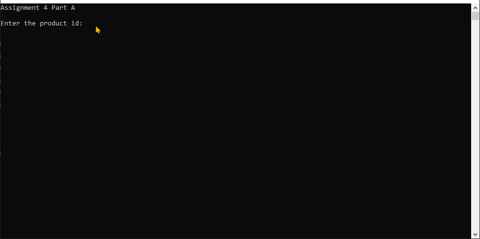
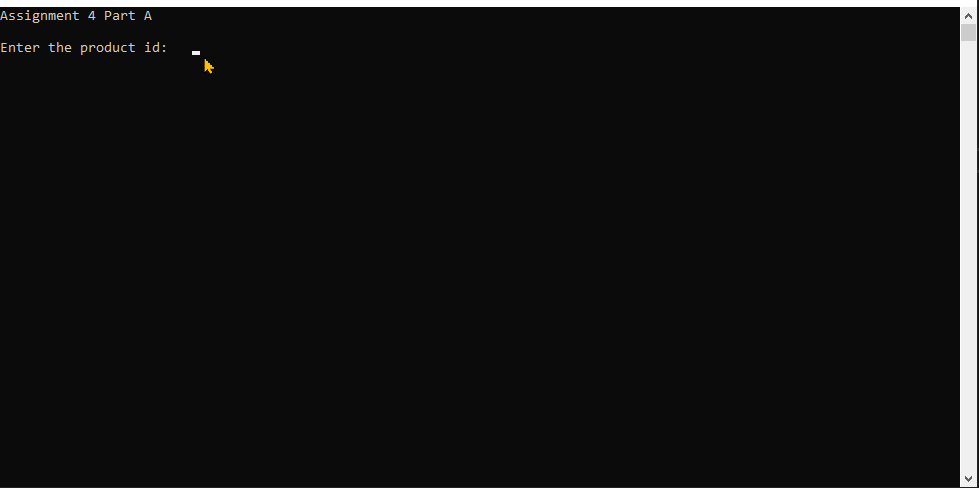
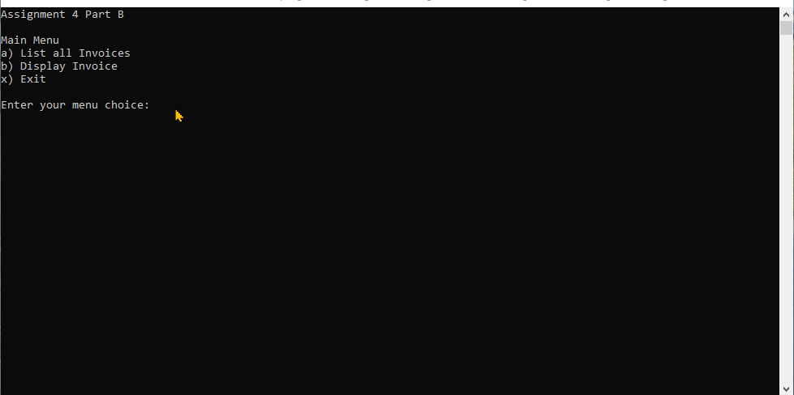
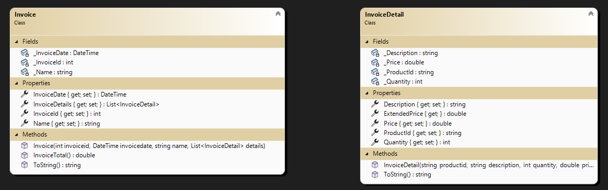

# Spring 2024 Assignment 04 - Working with Custom Objects
__Weight:__ 20% of final mark

__Submission requirements:__ On or before the deadline, commit a Visual Studio 2022 project to the GitHub repository. __You must commit and push to the classroom repository supplied for the assignment__; do not create your own repository. It is your responsibility to ensure that your work is in the correct repository. ___Work not in the repository will not be graded___.

## Context
A friend of yours is starting a retail computer hardware business. As part of their business operations, they need a simple system to help them store and track information about their sales. As a pilot, you've agreed to help them by creating a simple console application that will allow them to read/write invoices with details and information about those invoices. The application will display the invoice, invoice detail lines and totals. As time goes on, additional functionality can be added to the application.

## Requirements

The program build will be developed in two parts:

### Part A – Class and Object Implementation

<u>Invoice Detail Class</u>

Design a class named `InvoiceDetail` that meets the following  requirements:

- A `string` field to store the part's identification number and a corresponding property `ProductId` with both get and set
  - The identification cannot be empty, null, or whitespace; ensure that the stored value is trimmed of leading and trailing whitespace
- A `string` field to store the part's last description and a corresponding property `Description` with both get and set
  - The description cannot be empty, null, or whitespace; ensure that the stored value is trimmed of leading and trailing whitespace
- An `int` field to store the quantity purchased and a corresponding property `Quantity` with both get and set
  - The quantity must be greater than zero
- An `double` field to store the part's price and a corresponding property `Price` with both get and set
  - The price must be greater or equal to zero
- A greedy constructor that requires the product id, description, quantity and price as parameters
  - Use the properties in the constructor for setting the fields to take advantage of any validation checks already coded
- A read-only property named `ExtendedPrice` that will return as a `double` the extended price of the invoice item
- Overide the class's ToString() method and output your instance values `ProductId,Description,Quantity,Price`

#### Additional Information

The formula to calculate the extended item price follows:

<code>Formula: quantity * price</code>


Write a program to test your Client class as shown in the sample run below. The program must, at a minimum, demonstrate the following:

- a. prompt for a string
- b. prompt for an int
- c. prompt for a double
- d. create an instance of InvoiceDetail (prompt user for data and create invoice detail)
- e. display the data within the invoice detail instance (id, description, quantity, price and extended price)
- f. have appropriate error handling (i.e. the program must not crash)

#### Sample Program Run (Part A implementation)
_NOTE: the sample run does not demonstrate exception handling, ensure your program handles exceptions gracefully and does not crash._

#### Successful run



#### Validation run



### Part B - Invoice with a List of invoice details and Menu-Driven Program Implementation

### Create class `Invoice`

<u>Invoice Class</u>

Design a class named `Invoice` that meets the following  requirements:

- A `int` field to store the invoice number and a corresponding property `InvoiceId` with both get and set
  - The invoice number must be greater than zero
- A `datetime` field to store the invoice date and a corresponding property `InvoiceDate` with both get and set
  - The invoice date cannot be in the future
- An `string` field to store the sales person name and a corresponding property `Name` with both get and set
  - The name cannot be empty, null, or whitespace; ensure that the stored value is trimmed of leading and trailing whitespace
- An `List<InvoiceDetail>` field to store the parts purchased and a corresponding property `Details` with both get and set
  - The list must exist. It can be empty when the Invoice instance is first created.
  - use an auto-implemented property
- A greedy constructor that requires the invoice id, date, name and list of invoice details as parameters
  - Use the properties in the constructor for setting the fields to take advantage of any validation checks already coded
- A method named `InvoiceTotal()` that takes in **no parameters** and will return as a `double` the total of the invoice (sum of invoice detail items)
- Overide the class's ToString() method and output your instance values `InvoiceId,InvoiceDate,Name`. Use the DateTime method `ToShortDate()` when outputing your date.
  
NOTE: this is not a new program, add to your assignment 4 program. It is strongly suggested
 you comment the driver code of your Part A. Add the driver code for your Part B.

- The program should make use of file storage (i.e., CSV file) to store Invoices
- The ordering of records for the CSV file should contain two types of records: Invoice (Invoice fields) and InvoiceDetails (list of invoice details)
  - Invoice,InvoiceId,InvoiceDate,Name
  - InvoiceDetail,ProductId,Description,Quantity,Price 
  - InvoiceDetail,ProductId,Description,Quantity,Price 
  - InvoiceDetail,ProductId,Description,Quantity,Price 
  - InvoiceDetail,ProductId,Description,Quantity,Price 
- Load each Invoice from the file as an Invoice object and with its InvoiceDetail objects in a List within the Invoice instance. Each record will have a label identifing it as a Invoice or InvoiceDetail. Each Invoice will have one Invoice record followed by at least one InvoiceDetail record but there could be many.
- Display a selected invoice from the list of invoices (invoice and details)
- Read/load the invoice file into the system when the program begins (Sample input file has been supplied)
- Write the invoices to the file when the program ends
- Have appropriate error handling (i.e. the program must not crash)

Sample Main Menu Options
```
a) List all Invoices 
b) Display Invoice
x) Exit
```
Menu option a is just the invoice without its details.

__You must use a modular approach to your solution, parts A and B, utilize previous work and in-class examples to help with this task.__

Think carefully about how you will structure this program and consider the user experience when implementing it.

#### Successful run



#### Class Diagrams



## Coding Requirements
__NOTE:__ the following requirements are expected and you will not receive corrective feedback prior to the submission deadline if any of the following are unmet.

- A C# comment block at the beginning of the source file describing the purpose, author, and last modified date of the program
- Write only one statement per line
- You must use List for storing Clients in your solution
- Use camelCase for local variable names
- Use TitleCase for any constant variable names
- Use defensive programming where necessary
- Ensure graceful handling of exceptions
- Include summary comments for all defined methods

## Rubric [20 Marks Total]

### Part A [5 Marks - Class and Object Implementation]
| Mark | Description |
|----|----|
| 10 |  Excellent – Client class is properly defined: proper member variables (visibility, names, and types); proper member methods/properties (visibility, correct implementation, return correct values); constructor method is correctly defined; Client object(s) correctly instantiated and used in program where required/appropriate; all required comments and documentation are present  |
| 8-9 |  Very Good – Client class is well defined: class implements all requirements; exhibits very minor deficiencies (e.g. comments or naming)  |
| 6-7 |  Acceptable – Client class is adequately defined: class implements most (less than 75%) requirements; exhibits minor deficiencies (e.g. comments, naming, or visibility)  |
| 4-5 |  Needs Work – Client class is poorly defined: class implements less than half of the requirements; exhibits minor deficiencies (e.g. comments, naming, or visibility)  |
| 1-3 |  Unsatisfactory – Client class is improperly defined: class implements less than half of the requirements; exhibits major deficiencies (e.g. comments, naming, visibility, types or signatures)  |
|  0 |  Not done; poorly implemented; class does not demonstrate any of the requirements  |

### Part A [5 Marks - Program Completion]
| Mark | Description |
|----|----|
|  5 |  Excellent – program passes all test cases (see included sample run); coding follows best practices and class standards; logic structure is efficient with no redundant code; program does not crash; program properly makes use of the user-defined class/objects  |
|  4 |  Very Good – program produces the expected results for most of the test case results; coding does not follow best practices and class standards in few instances; minor logic errors; redundant code; program does not crash; program properly makes use of the user-defined class/objects  |
|  3 |  Acceptable – program produces the expected results for some of the test case results; coding does not follow best practices and class standards in many instances; major logic errors; redundant code; program may crash unexpectedly; program makes use of the user-defined class/objects  |
|  2 |  Needs Work – program fails to produce expected results; coding does not follow best practices and class standards; major logic errors; redundant code; program crashes unexpectedly; program does not make use of the user-defined class/objects  |
|  1 |  Unsatisfactory – program fails to produce expected results; coding does not follow best practices and class standards; major logic errors; redundant code; aborts when executed/ program crashes always; program does not make use of the user-defined class/objects  |
|  0 |  Not done; poorly attempted; major logic errors; major design problems; a scaffold was submitted  |

### Part B [5 Marks - Class and Object Implementation]
| Mark | Description |
|----|----|
| 10 |  Excellent – Client class is properly defined: proper member variables (visibility, names, and types); proper member methods/properties (visibility, correct implementation, return correct values); constructor method is correctly defined; Client object(s) correctly instantiated and used in program where required/appropriate; all required comments and documentation are present  |
| 8-9 |  Very Good – Client class is well defined: class implements all requirements; exhibits very minor deficiencies (e.g. comments or naming)  |
| 6-7 |  Acceptable – Client class is adequately defined: class implements most (less than 75%) requirements; exhibits minor deficiencies (e.g. comments, naming, or visibility)  |
| 4-5 |  Needs Work – Client class is poorly defined: class implements less than half of the requirements; exhibits minor deficiencies (e.g. comments, naming, or visibility)  |
| 1-3 |  Unsatisfactory – Client class is improperly defined: class implements less than half of the requirements; exhibits major deficiencies (e.g. comments, naming, visibility, types or signatures)  |
|  0 |  Not done; poorly implemented; class does not demonstrate any of the requirements  |

### Part B [5 Marks - Extended Program Completion]
| Mark | Description |
|----|----|
|  5  |  Excellent – program correctly reads and writes Client objects from files as required by the program specifications; the program manages Client objects in a List; errors when reading/writing files will not crash the program; required CSV file format is implemented for written files; correct implementation of menu-driven program requirements; defensive programming techniques are applied when appropriate  |
|  4  |  Very Good – program correctly reads and writes Client objects from files as required by the program specifications; the program manages Client objects in a List; errors when reading/writing files will not crash the program; required CSV file format is implemented for written files with minor error(s); good implementation of menu-driven program requirements (minor errors in logic or a missing option); defensive programming techniques are applied in some cases  |
|  3  |  Acceptable – program correctly reads and writes Client objects from files as required by the program specifications; the program manages Client objects in a List; errors when reading/writing files will crash the program in most cases; required CSV file format is implemented for written files with minor error(s); adequate implementation of menu-driven program requirements (major errors in logic or several missing options); defensive programming techniques are not applied in most cases  |
|  2  |  Needs Work – program reads or writes Client objects from files with errors; the program does not use a List to manage Client objects; errors when reading/writing files will crash the program; required CSV file format is not correctly implemented; adequate implementation of menu-driven program requirements (major errors in logic and several missing options); defensive programming techniques are not applied  |
|  1  |  Unsatisfactory – program attempts much of the Part B requirements, but does not successfully implement any of them  |
|  0  |  Not done; poorly attempted; files are neither written or read by the program; Client objects are not managed by the program  |
